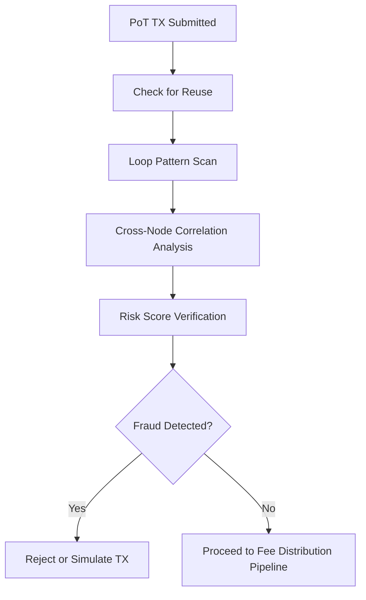

# emission_fraud_prevention.md

## Module: Fee Distribution Fraud Prevention
- **Layer**: Fee Distribution Layer — AST (Aros Studio Tokenomics)
- **Status**: Production-grade
- **Author**: Aros Studio NodeChain Division
- **Last Updated**: 2025-07-05


---

## Overview

This module defines protective mechanisms that prevent abuse, manipulation, or artificial triggering of ArosCoin (AROS) emission events. Since emission in AST is transaction-driven and directly linked to Proof of Transaction (PoT), it is critical to guard against:

- Fabricated transactional loops
- Cross-node collusion to inflate emission activity
- Replay attacks
- Shard-level saturation
- Risk model circumvention

All fraud prevention logic is enforced **before**, **during**, and **after** the emission trigger pipeline.

---

## Attack Vectors & Mitigations

### 1. Replay Attacks

| Vector | Re-submitting the same transaction in a different context to retrigger emission |
|--------|----------------------------------------------------------------------------------|
| Mitigation | Every TX is marked as `emission-spent` after triggering. Replay is blocked at validation level. |

---

### 2. PoT-Loop Fabrication

| Vector | Generating circular transactions between multiple wallets to simulate activity |
|--------|---------------------------------------------------------------------------------|
| Mitigation | PoT attestation engine detects unnatural bidirectional patterns; risk score increased exponentially on loops. |

---

### 3. Multi-Node Collusion

| Vector | Coordinated false transaction generation across validator clusters |
|--------|---------------------------------------------------------------------|
| Mitigation | Cross-node PoT hash audit; threshold-based detection; emission quota throttled on correlated anomalies. |

---

### 4. Shard Saturation

| Vector | Flooding a specific shard with small valid transactions to consume its quota |
|--------|------------------------------------------------------------------------------|
| Mitigation | Minimum TX weight enforcement; batch normalization; shard-based guardrails apply penalties. |

---

### 5. Risk Score Evasion

| Vector | Manipulating metadata to artificially reduce risk classification |
|--------|-------------------------------------------------------------------|
| Mitigation | AI-assisted behavioral scoring; consistency checks against past transaction fingerprints. |

---

## Safeguards in Fee Distribution Flow

| Layer | Checkpoint |
|-------|------------|
| `emission_trigger_conditions.md` | Validates unique TX, quota limits, blacklist |
| `proof_of_transaction_engine.md` | Attestation must include entropy check, source diversity |
| `tx_validation_pipeline.md` | High-risk scores are escalated or simulated only |
| `tx_journal_writer.md` | Duplicates and re-entry attempts are logged and rejected |

---

## Fraud Score Accumulation

Each validator and wallet address accumulates a "fraud suspicion index" over time. Reaching threshold levels results in:

- Temporary emission disqualification
- Governance-based review
- Flagging in `tx_trace_flags.md`
- Potential risk buffer forfeiture

---

```

---



## Dependencies

- `proof_of_transaction_engine.md`
- `tx_validation_pipeline.md`
- `emission_trigger_conditions.md`
- `tx_trace_flags.md`
- `tx_journal_writer.md`

---

## Next

→ See [`emission_reporting_and_traceability.md`](https://www.notion.so/aros-studio/emission_reporting_and_traceability.md) to understand how emission events are recorded, audited, and externally verified.

```

```
