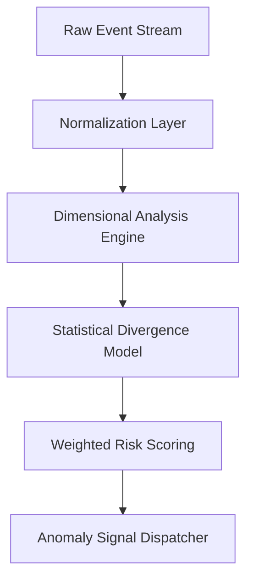

# anomaly_detection_engine.md

## Module: Anomaly Detection Engine
- **Layer**: NodeChain AI Agents – AST (Aros Studio Tokenomics)
- **Status**: Production-grade
- **Author**: Aros Studio NodeChain Division
- **Last Updated**: 2025-07-05

---

## Purpose

Define the core architecture and functional model of the Anomaly Detection Engine (ADE), which processes multi-dimensional transaction and validator telemetry to emit weighted anomaly signals used in fraud prevention, slashing decisions, governance alerts, and audit triggering.

---

## Input Dimensions

ADE receives real-time streaming vectors from:

- Transaction streams (TX metadata, signature properties, timestamp gaps)
- Validator activity (uptime, voting pattern divergence, heartbeat anomalies)
- Pattern recognition agents (tagged behaviors, risk-labeled TXs)
- Shard-level congestion and throughput deltas
- External oracles (exchange spikes, fee volatility, geopolitical alerts)

---

## Signal Processing Pipeline



---

## Detection Layers

| Layer | Description |
| --- | --- |
| Normalization Layer | Standardizes and filters noisy or malformed input data |
| Dimensional Analysis | Projects event features into high-dimensional anomaly space |
| Divergence Modeling | Applies multivariate statistical thresholds |
| Risk Weighting Engine | Computes confidence and risk impact across 0–1 range |
| Dispatcher | Forwards weighted anomaly signals to FRAUD-AI and GOV-AI |

---

## Output Format

```json
{
  "agent_id": "ADE-AI-0174",
  "event_type": "validator_behavior",
  "detected_anomaly": "heartbeat_dropout",
  "risk_score": 0.84,
  "confidence": 0.91,
  "related_entity": "V-8841",
  "shard_id": "S-06",
  "timestamp": 1720944532
}

```

---

## Thresholds & Rules

- `risk_score > 0.70` → escalate to `FRAUD-AI`
- `risk_score > 0.85 && confidence > 0.90` → forward to `GOV-AI`
- All scores ≥ 0.65 logged to `AUDIT-EMIT`

---

## Meta-Adaptive Feedback

ADE weights and scoring thresholds are subject to periodic re-tuning by `META-AI-0088` based on historical incident resolution outcomes.

---

## Dependencies

- `tx_pattern_recognition.md`
- `validator_behavior_monitor.md`
- `audit_trace_emitter.md`
- `governance_escalation.md`
- `meta_learning_feedback_loop.md`

---

## Next

→ Proceed to [`fraud_signal_dispatcher.md`](https://www.notion.so/aros-studio/fraud_signal_dispatcher.md) to understand how signals become actionable chain-level responses.

```

```
